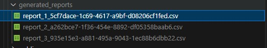

## Utilizando a aplicação

### Acessando o banco de dados

Para conectar programas como o **MySQL Workbench** ou o **DBeaver** ao banco de dados da aplicação, você pode utilizar as seguintes configurações:

```
hostname: mysql ou localhost
port: 3398
username: root
password: root
```

### Armazenando arquivo de logs no storage

Antes de começar a usar a aplicação, é necessário garantir que o arquivo **logs.txt** - fornecido pelo desafio - está armazenado na pasta `storage/app/gateway_logs`. Para isso, siga as seguintes etapas:

- Acesse a pasta especificada e remova quaisquer arquivos que estejam presentes (pode ser que exista um arquivo *placeholder*).

- Faça o download do arquivo **logs.txt** na url `https://github.com/dehsilvadeveloper/relatorios-de-gateway/blob/main/storage/app/gateway_logs/logs.txt` (utilize a opção **Download Raw File** no repositório) e coloque-o na pasta `storage/app/gateway_logs`.

Pronto! Agora o arquivo está pronto para ser usado pela aplicação.

### Importando as informações do arquivo de log

Com a certeza de que o arquivo **logs.txt** existe no diretório esperado, você deverá acessar o container da aplicação e rodar o comando de importação:

```bash
# Para entrar no container
docker-compose exec -it main bash

# Comando de importação
php artisan import:gateway-log
```

A aplicação irá fazer a leitura do arquivo e salvar os dados pertinentes no banco de dados. Você poderá acompanhar o progresso do processo de importação no próprio terminal.

<a href="./images/print_01.jpeg" target="_blank">
    
</a>

Após o fim da importação, você poderá visitar o banco de dados e conferir se os dados foram salvos corretamente na tabela `gateway_logs`.

### Solicitando um novo relatório

Para solicitar a geração de um novo relatório, você deverá efetuar uma requisição para a api conforme exemplificado a seguir.

```
POST localhost:9998/api/reports
Accept: application/json
Content-Type: application/json

{
    "report_type_id": 1
}
```

Neste caso `report_type_id` refere-se ao **tipo de relatório** desejado. Em caso de sucesso, a solicitação será registrada com o status *pendente* e ficará aguardando que o comando de geração de relatórios seja executado (saiba mais sobre essa etapa no tópico **Gerando relatórios**).

Caso queira saber os **tipos de relatórios** que podem ser gerados, você pode usar a requisição a seguir.

```
GET localhost:9998/api/report-types
Accept: application/json
Content-Type: application/json
```

Você também pode consultar a lista de **tipos de relatórios** na tabela a seguir.

| Id | Nome |
|-|-|  
| 1 | total requisições por consumidor | 
| 2 | total requisições por serviço |
| 3 | tempo médio das latências por serviço |

### Consultando o progresso de relatórios

Caso queira saber se um relatório já foi gerado, você pode usar a requisição a seguir.

```
GET localhost:9998/api/reports
Accept: application/json
Content-Type: application/json
```

A resposta obtida irá conter uma lista de relatórios cadastrados na tabela `reports` do banco de dados contendo o **status** atual dos mesmos.

Caso queira saber os **status possíveis** para solicitações de relatórios, você pode usar a requisição a seguir.

```
GET localhost:9998/api/report-statuses
Accept: application/json
Content-Type: application/json
```

Você também pode consultar a lista de **status possíveis** na tabela a seguir.

| Id | Nome |
|-|-|  
| 1 | pendente | 
| 2 | concluído |
| 3 | erro |

### Efetuando o download de um relatório

Para efetuar o download do arquivo de um relatório, você deve efetuar uma requisição conforme exemplificado a seguir.

```
GET localhost:9998/api/reports/1/download
Accept: application/json
```

Vale ressaltar que só é possível efetuar o download de arquivos de relatórios de solicitações que já tenham sido sinalizadas como **concluídas**.

### Gerando relatórios

A aplicação conta com um comando para gerar relatórios no formato `.csv` que deverá ser executado de dentro do container da aplicação.

```bash
# Para entrar no container
docker-compose exec -it main bash

# Comando de geração de relatórios
php artisan reports:generate
```

Você poderá acompanhar o progresso do processo no próprio terminal.

<a href="./images/print_02.jpeg" target="_blank">
    
</a>

O comando irá verificar se existem registros na tabela `reports` com o status **pendente** e, em caso positivo, vai buscar os dados necessários para a confecção do relatório de acordo com o seu tipo (especificado na coluna *report_type_id*).

Caso a geração do relatório seja um sucesso, você poderá notar que o registro na tabela `reports` foi atualizado e agora as colunas **filename** e **generated_at** estão preenchidas, além do status (referenciado pela coluna *report_status_id*) ter sido modificado para **concluído**. O arquivo `.csv` do relatório estará presente no diretório `storage/app/generated_reports`.

<a href="./images/print_03.jpeg" target="_blank">
    
</a>

Vale ressaltar que os tipos de relatórios solicitados pelo desafio foram os seguintes:

- Total de requisições por consumidor.
- Total de requisições por serviço.
- Tempo médio das latências (`request`, `proxy` e `gateway`) agrupadas por serviço.

## Queries dos relatórios

As seguintes `SQL queries` foram utilizadas para obter os dados dos relatórios no banco de dados.

- Total de requisições por consumidor

```sql
SELECT consumer_id, COUNT(*) AS total_requests FROM gateway_logs GROUP BY consumer_id ORDER BY consumer_id;
```

- Total de requisições por serviço

```sql
SELECT service_id, service_name, COUNT(*) AS total_requests FROM gateway_logs GROUP BY service_id, service_name ORDER BY service_id;
```

- Tempo médio das latências (`request`, `proxy` e `gateway`) agrupadas por serviço

```sql
SELECT service_id, service_name, AVG(latency_proxy) AS avg_time_latency_proxy, AVG(latency_gateway) AS avg_time_latency_gateway, AVG(latency_request) AS avg_time_latency_request FROM gateway_logs GROUP BY service_id, service_name ORDER BY service_id;
```