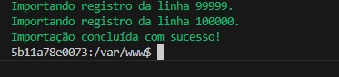
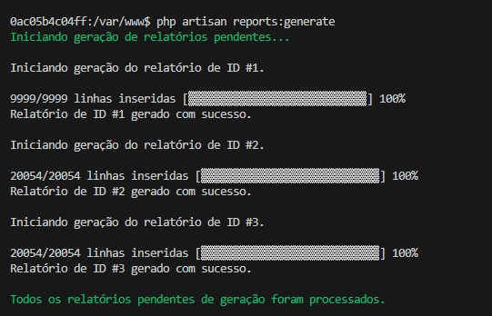

## Utilizando a aplicação

### Acessando o banco de dados

Para conectar programas como o **MySQL Workbench** ou o **DBeaver** ao banco de dados da aplicação, você pode utilizar as seguintes configurações:

```
hostname: mysql ou localhost
port: 3398
username: root
password: root
```

### Importando as informações do arquivo de log

Por padrão arquivo **logs.txt** - fornecido pelo desafio - fica armazenado na pasta `storage/app/gateway_logs`. Se, ao clonar o repositório, o arquivo não tiver vindo junto, você pode fazer o download do mesmo na url `https://github.com/dehsilvadeveloper/relatorios-de-gateway/blob/main/storage/app/gateway_logs/logs.txt` e colocá-lo no diretório especificado manualmente.

Com a certeza de que o arquivo **logs.txt** existe no diretório esperado, você deverá acessar o container da aplicação e rodar o comando de importação:

```bash
# Para entrar no container
docker-compose exec -it main bash

# Comando de importação
php artisan import:gateway-log
```

A aplicação irá fazer a leitura do arquivo e salvar os dados pertinentes no banco de dados. Você poderá acompanhar o progresso do processo de importação no próprio terminal.

<a href="./images/print_01.jpeg" target="_blank">
    
</a>

Após o fim da importação, você poderá visitar o banco de dados e conferir se os dados foram salvos corretamente na tabela `gateway_logs`.

### Solicitando um novo relatório

Breve.

### Consultando o progresso de relatórios

Breve.

### Efetuando o download de um relatório

Breve.

### Gerando relatórios

A aplicação conta com um comando para gerar relatórios no formato `.csv` que deverá ser executado de dentro do container da aplicação.

```bash
# Para entrar no container
docker-compose exec -it main bash

# Comando de geração de relatórios
php artisan reports:generate
```

Você poderá acompanhar o progresso do processo no próprio terminal.

<a href="./images/print_02.jpeg" target="_blank">
    
</a>

O comando irá verificar se existem registros na tabela `reports` com o status **pendente** e, em caso positivo, vai buscar os dados necessários para a confecção do relatório de acordo com o seu tipo (especificado na coluna *report_type_id*).

Caso a geração do relatório seja um sucesso, você poderá notar que o registro na tabela `reports` foi atualizado e agora as colunas **filename** e **generated_at** estão preenchidas, além do status (referenciado pela coluna *report_status_id*) ter sido modificado para **concluído**. O arquivo `.csv` do relatório estará presente no diretório `storage/app/generated_reports`.

Vale ressaltar que os tipos de relatórios solicitados pelo desafio foram os seguintes:

- Total de requisições por consumidor.
- Total de requisições por serviço.
- Tempo médio das latências (`request`, `proxy` e `gateway`) agrupadas por serviço.

## Queries dos relatórios

As seguintes `SQL queries` foram utilizadas para obter os dados dos relatórios no banco de dados.

- Total de requisições por consumidor

```sql
SELECT consumer_id, COUNT(*) AS total_requests FROM gateway_logs GROUP BY consumer_id ORDER BY consumer_id;
```

- Total de requisições por serviço

```sql
SELECT service_id, service_name, COUNT(*) AS total_requests FROM gateway_logs GROUP BY service_id, service_name ORDER BY service_id;
```

- Tempo médio das latências (`request`, `proxy` e `gateway`) agrupadas por serviço

```sql
SELECT service_id, service_name, AVG(latency_proxy) AS avg_time_latency_proxy, AVG(latency_gateway) AS avg_time_latency_gateway, AVG(latency_request) AS avg_time_latency_request FROM gateway_logs GROUP BY service_id, service_name ORDER BY service_id;
```